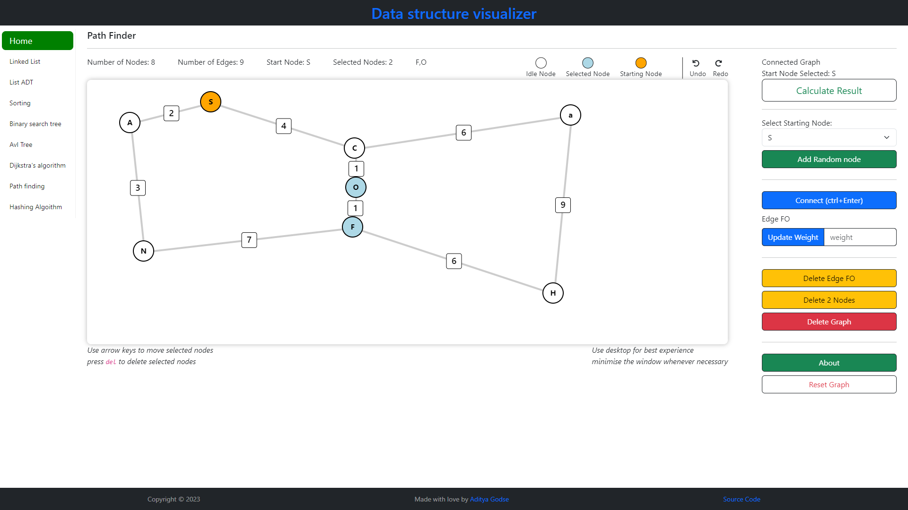
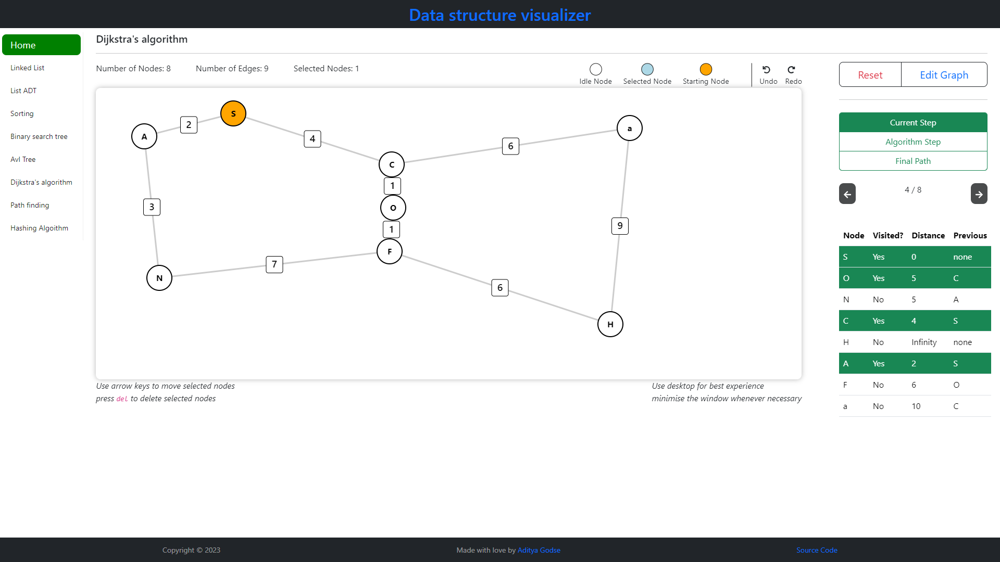
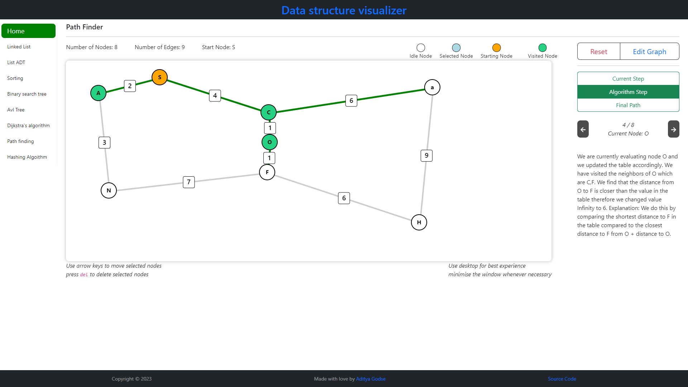
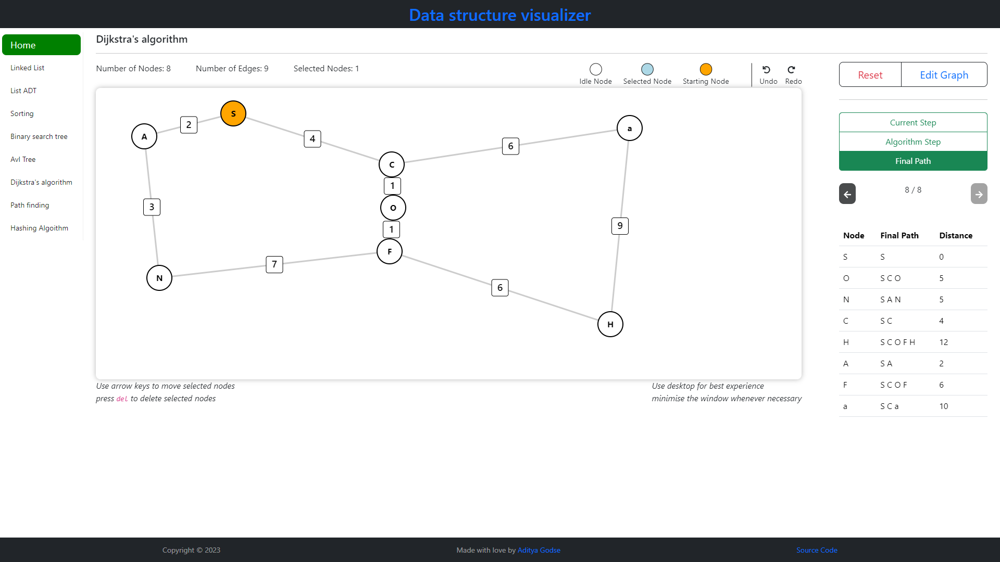

# Visual Data Structures (visual-code-studio)

visual-code-studio is a Data Structure Playground that you can use as a simulator to visualize various Data Structures and Algorithms. These include Linked lists, list ADTs (Stack, queue), Sorting Algorithms, Binary Search Trees, AVL trees, B+ trees, Pathfinding Algorithms, and Hashing Algorithms.

**Note:** This is not an implementation of the data structure itself in TypeScript; it is a visualization of how these data structures work.

This project is my attempt to learn TypeScript and the React framework for building interactive web applications.

Tools used in building this project include React as the frontend framework, Bootstrap for UI components (modals, tooltips, buttons, and icons), framer motion for animations, animejs, and immer.

Please excuse the poor structure of my code and components. I am a beginner who's learning-relearning-unlearning lot of things.

## What's New?

now you can see the steps of the Dijkstra's single source shortest path algorithm where it calculates the distance to all nodes in a graph through iterations. You can navigate the steps of the iterations

## Installation

**Required:** Node.js Version 18+

## Webpage screenshots

### Dijkstra Algorithm Navigation Steps

| Current Step Navigation                       | Algorithm Step Navigation                     | Final Path Navigation                         |
| --------------------------------------------- | --------------------------------------------- | --------------------------------------------- |
|  |  |  |

## How to Use This Site

### keyboard Shortcuts

| Shortcut           | Function                                                  | Algorithm      |
| ------------------ | --------------------------------------------------------- | -------------- |
| Space bar          | Toggle sorting in sorting algorithms                      | Sorting        |
| Arrow Keys         | Move Some steps forward and backward in sorting algorithm | Sorting        |
| Arrow Keys         | Move nodes in graph algorithms by step 3                  | Path, DIjkstra |
| Ctrl + Arrow Keys  | Move nodes in graph algorithms by step 5                  | Path, DIjkstra |
| Ctrl + Node select | Deselect all other nodes and select only single node      | Path, DIjkstra |
| del                | Delete selected nodes                                     | Path, DIjkstra |
| Ctrl + Enter       | Joins two selected nodes                                  | Path, DIjkstra |
| Ctrl + Z           | Undo                                                      | Path, DIjkstra |
| Ctrl + Y           | Redo                                                      | Path, DIjkstra |
| Ctrl + del         | Delete edge between two selected nodes                    | Path, DIjkstra |

1. **Linked list:** Perform CRUD operations on a linked list and reverse it.
2. **List ADT:** Visualize stacks and queues, and perform push-pop and enqueue-dequeue operations.
3. **Sorting:** Adjust bin size and animation speed to visualize sorting algorithms. Use keyboard keys to control animations (Space key to toggle play and pause, Arrow keys to skip steps). Supported algorithms include:
   - Selection Sort
   - Insertion Sort
   - Quick Sort
   - Merge Sort
   - Bubble Sort
4. Binary Search Tree: We can perform CURD operations on the tree, calculate the size, number of leaf nodes, tree height, get its in-order, pre-order, post-order, depth-first and breadth-first traversal. You can also insert multiple elements at one time.
5. AVL tree: The tree is not yet balanced and I am working on the rotation algorithm. You can still perform CURD operations, but the load factor goes beyond the desired range and tree is unbalanced
6. Dijkstra's Path Finding Algorithm: You can add nodes by clicking in the working area, add edges, update weights, calculate shortest path between all nodes from a start node, and you can do a lot more. Also use keyboard shoetcuts to make your workflow better.
7. _I came across [visualgo](https://visualgo.net/en) where I was quite attracted to their educational visualizations, and thought hashing algorithms can also be visualized to help better understand them for begineers_

## To-Do List

- AVL tree rotations
- Dijkstra's Algorithm dragable node bugs
- Hashing algorithm
- Implement "Insert after" function in linked list
- Implement Doubly and circular linked list
- Figure out howler library to add sound effects in sorting visualizer

## Contributing

Pull requests are welcome. For major changes, please open an issue first to discuss what you would like to change.

## License

[MIT](https://choosealicense.com/licenses/mit/)
